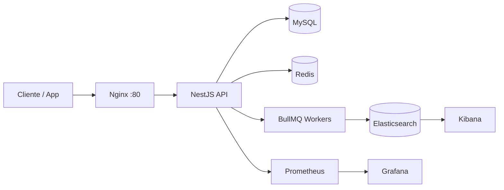

# Feature Flag API

> API de **feature flags** e **UX research** em produção-ready: rollout gradual, segmentação por usuário/empresa, cache, filas assíncronas e observabilidade completa.

[](https://nestjs.com/)
[](https://www.typescriptlang.org/)
[](https://nodejs.org/)
[](./test)
[](./LICENSE)

---

## Em uma frase

Microserviço backend que permite **ligar e desligar funcionalidades sem deploy**, com cinco estratégias de rollout, auditoria em Elasticsearch e stack de observabilidade (Prometheus + Grafana + Kibana) — pensado para times que precisam de **releases seguras e experimentação controlada**.

---

## Por que olhar este repositório?

| O que você vê aqui | O que isso demonstra |
|---|---|
| **Clean Architecture** (domain → application → infrastructure) | Separação de responsabilidades e código testável |
| **Strategy pattern** no check de flags | Extensibilidade sem `if/else` gigante |
| **117+ arquivos de teste** (unit, integration, e2e) | Cultura de qualidade e regressão controlada |
| **Docker Compose** com 8 serviços | Experiência com infra local e integração real |
| **BullMQ + Redis** para logs de auditoria | Processamento assíncrono e resiliência (dead-letter) |
| **Swagger** separado por domínio | Documentação de API como produto |
| **Husky pre-commit** | Segurança (bloqueio de `.env`) + testes antes do commit |

---

## Destaques técnicos

### Feature flags com rollout inteligente

Cada flag suporta um tipo de segmentação:

| Tipo | Comportamento |
|------|----------------|
| `percentage` | Rollout global por percentual |
| `user` | Lista explícita de usuários |
| `company` | Lista explícita de empresas |
| `user_percentage` | Percentual dentro de um conjunto de usuários |
| `company_percentage` | Percentual dentro de um conjunto de empresas |

O `CheckFeatureFlagUseCase` delega para a estratégia correta via `ModuleRef`, mantendo o fluxo principal enxuto e aberto a novos tipos.

### Dois domínios, uma base sólida

- **Feature Flag** — CRUD administrativo (STS), check público e importação em massa de IDs.
- **UX Research** — Mesmo padrão arquitetural, com coleta e consulta de respostas de pesquisa.

### Observabilidade de ponta a ponta

- **Prometheus** + interceptor customizado para métricas HTTP
- **Grafana** em `/metrics/`
- **Elasticsearch** + **Kibana** em `/logs/` para trilha de auditoria
- **Nginx** como reverse proxy unificando app, logs e métricas



---

## Stack

| Camada | Tecnologias |
|--------|-------------|
| **Runtime** | Node.js, NestJS 11, TypeScript |
| **Persistência** | TypeORM, MySQL 8, migrations |
| **Cache** | Redis + `cache-manager` |
| **Filas** | BullMQ |
| **Busca / logs** | Elasticsearch 8 |
| **API** | Swagger/OpenAPI, versionamento URI (`/v1`) |
| **Auth** | JWT + API Key (endpoints STS vs públicos) |
| **Qualidade** | Jest, ESLint, Prettier, Husky |
| **Infra local** | Docker Compose, Nginx |

---

## Como rodar (recomendado)

### Pré-requisitos

- [Docker](https://www.docker.com/) e Docker Compose
- Node.js 22+ (opcional, para rodar fora do container)

### Subir o ambiente completo

```bash
docker compose up --build
```

| Serviço | URL |
|---------|-----|
| API (via Nginx) | http://localhost |
| Swagger — Feature Flag | http://localhost/api/docs/feature-flag |
| Swagger — UX Research | http://localhost/api/docs/ux-research |
| Kibana (logs) | http://localhost/logs/ |
| Grafana (métricas) | http://localhost/metrics/ |

### Variáveis de ambiente

Copie o exemplo e preencha com seus valores:

```bash
cp .env.example .env
```

---

## Desenvolvimento local (sem Docker)

```bash
npm install
npm run start:dev
```

A API sobe na porta definida em `PORT` (padrão **3001**).

---

## Testes

O projeto prioriza confiança em refatorações:

```bash
# Unitários (~90 specs)
npm run test:unit

# Integração com banco (7 specs)
npm run test:integration

# End-to-end (20 specs)
npm run test:e2e

# Cobertura
npm run test:cov
```

Antes de cada commit, o **Husky** executa os testes unitários e impede vazamento de secrets (`.env` e tokens no `.env.example`).

---

## Estrutura do projeto

```
src/
├── modules/
│   ├── feature-flag/     # Domínio de feature flags
│   │   ├── domain/       # Entidades, enums, interfaces de repositório
│   │   ├── application/  # Use cases, DTOs, mappers, services
│   │   └── infraestructure/  # TypeORM, controllers, processors
│   ├── ux-research/      # Domínio de pesquisas UX (mesmo padrão)
│   └── common/           # Auth, cache, metrics, logging, filas
├── app.module.ts
└── main.ts
test/
├── unit/
├── integration/
└── e2e/
```

---

## Endpoints principais

### Públicos (consumo da aplicação)

| Método | Rota | Descrição |
|--------|------|-----------|
| `POST` | `/v1/feature-flag/check-feature-flag` | Verifica se a flag está ativa para o contexto |
| `POST` | `/v1/ux-research/check` | Verifica elegibilidade para UX research |

### Administrativos — STS (autenticação)

Gestão completa: criar, ativar/desativar, buscar, importar IDs em massa e excluir — disponível para **feature-flag** e **ux-research**. Detalhes e schemas no Swagger.

---

## O que eu aprendi / apliquei neste projeto

- Modelar **domínios distintos** reutilizando padrões (não copy-paste cego).
- Escolher **estratégias de rollout** adequadas a cada cenário de produto.
- Garantir **rastreabilidade** com filas, dead-letter e índice de auditoria.
- Entregar API **documentada, versionada e testada em camadas**.
- Montar ambiente de desenvolvimento que espelha preocupações de **produção** (proxy, métricas, logs).

---

## Repositório e contato

- **GitHub:** [@emaurilio/feature-flag](https://github.com/emaurilio/feature-flag)
- **Autor:** Maurilio Eduardo:

  > [](https://www.linkedin.com/in/maur%C3%ADlio-eduardo-8b51aa172/)
